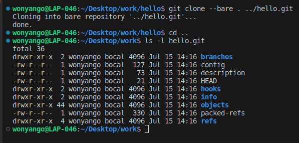
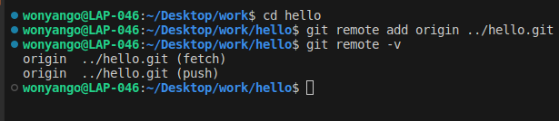
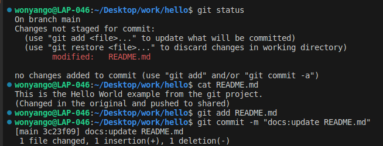
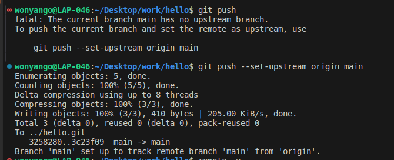
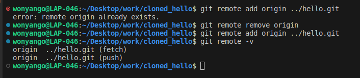
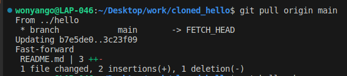
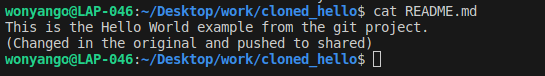

### What is a bare repository and why is it needed?

A bare repository is a repository without a working tree, typically used as a remote repository where developers can push and pull code. This is useful for developers who have a shared drive and prefer not to use external services like GitHub.

### Create a bare repository named hello.git from the existing hello repository.

```console
git clone --bare . ../hello.git
```


### Add the bare hello.git repository as a remote to the original repository hello.

```console
git remote add origin ../hello.git
```



### I then changed the README 



### I then pushed the changes to the shared repository



### Switch to the cloned repository cloned_hello and pull down the changes just pushed to the shared repository.

To pull, I have to first add the bare repository as the remote.

However, I encountered an issue since the remote origin already exists. I removed it with:  ```git remote remove origin```. I then updated the remote successfully:



I then pulled the changes:



The changes are now reflected in the cloned_repository:

