## Changed your mind?
#### Reverting changes
I made changes to the file

I then went ahead and restored the file to the way it was before the changes using:

```console
git restore hello.sh
```

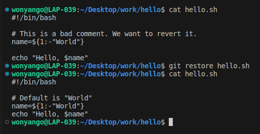


#### Staging and Cleaning:

I then introduced unwanted changes to the file

I staged them and then cleaned the staging area to discard the changes:
```console
git restore --staged hello.sh
```
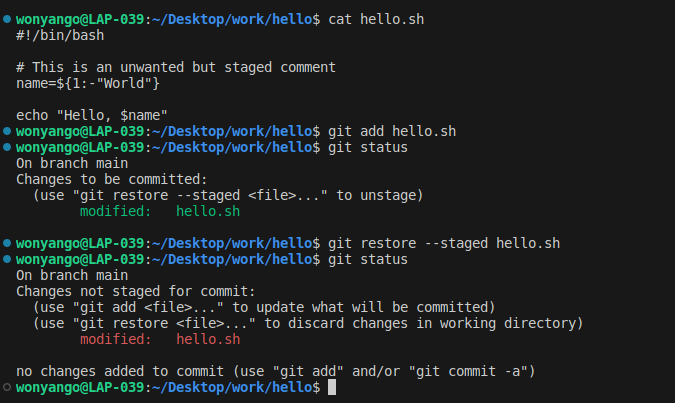

I then added unwanted changes again, staged the file and committed the changes

Thereafter, I reverted them back to their original state:
```console
git revert HEAD
```
If nano opens: Just press Ctrl+X and the reverting will be completed

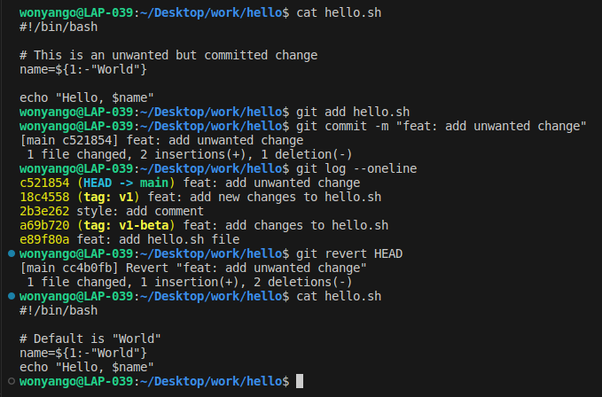

#### Tagging and Removing Commits: 

I tagged the latest commit with oops

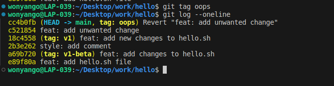

I then reset to v1:
```console
git reset --hard v1
```
The commits made after the v1 version will be removed 

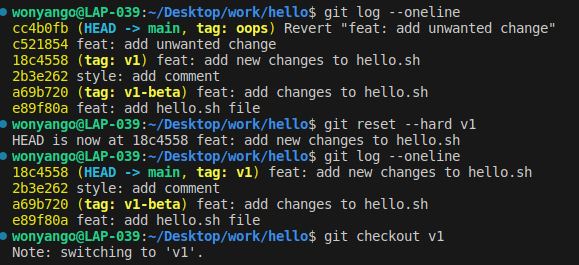

I also checked out v1 to ensure head is at v1:

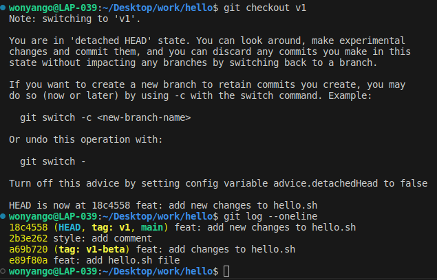

#### Displaying Logs with Deleted Commits: 
Use: 
```console
git reflog
```
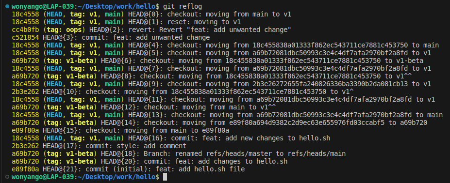

To be more specific and get the commit tagged oops:

```console
git show oops
```
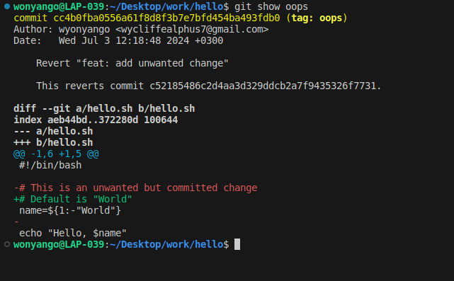

#### Cleaning Unreferenced Commits: 

To delete unreferenced commits from history use:
```console
git gc --prune=now
```
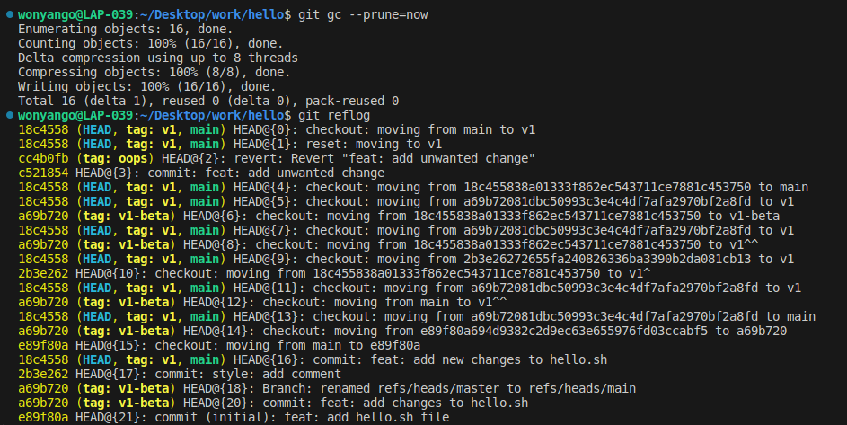

However, after running 'git reflog' I noticed that the commit history with oops still exists.

I therefore used :
```console
git reflog delete HEAD@{2}
```
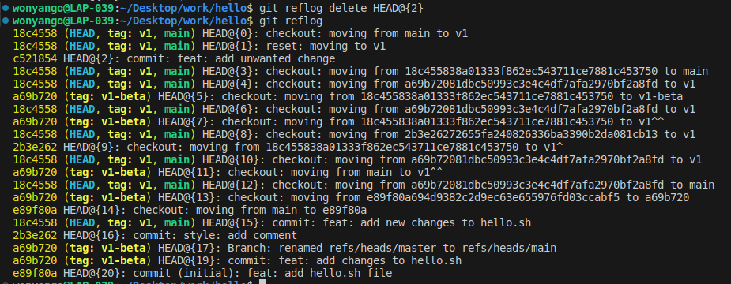

After ensuring that I have deleted the commits that came after v1, below is the result:

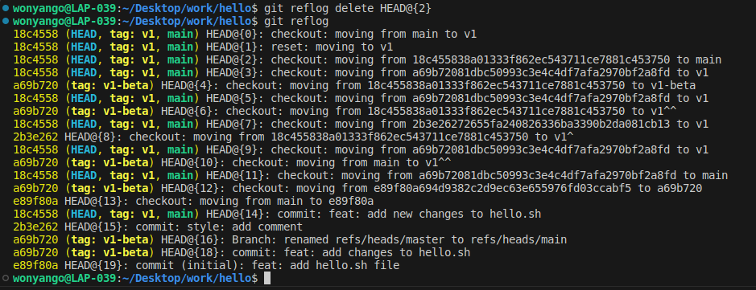

#### Author Information: 

I then made changes to the file to include author name and committed the changes:

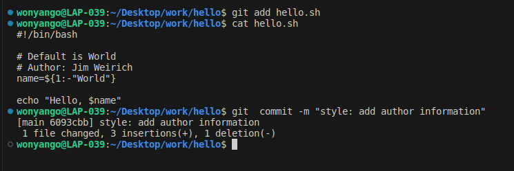

##### To add the email of the author without adding a new commit:

First stage the changes and run the command:

```console
git commit --amend --no-edit
```
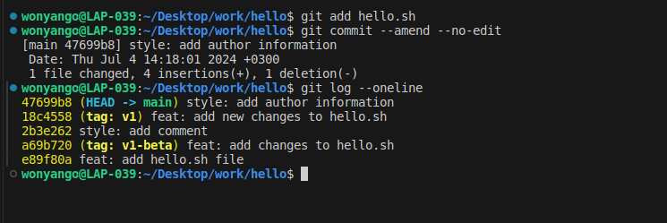