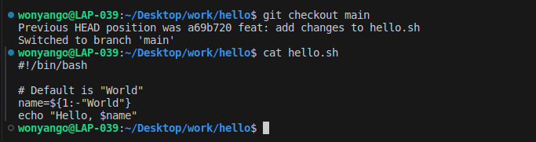

## Check it out

### Restore First Snapshot

To revert to the first version of the file, first find the relevant hash using :

```console
git log --oneline
```
Then checkout:
```console
git checkout e89f80a
```
Then print the content using:
```console
cat hello.sh
```


### Restore Second Recent Snapshot: 
```console
git checkout a69b720
```


### Restore Latest Version (without referring to specific hash):

```console
git checkout main
```

