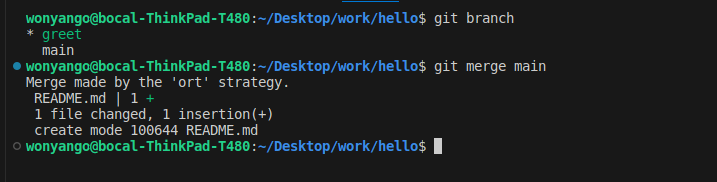
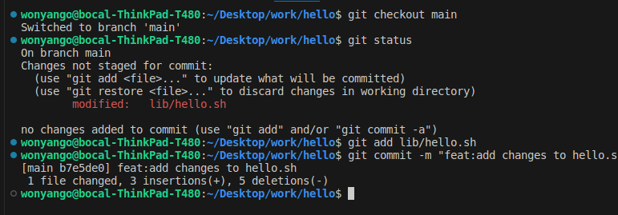
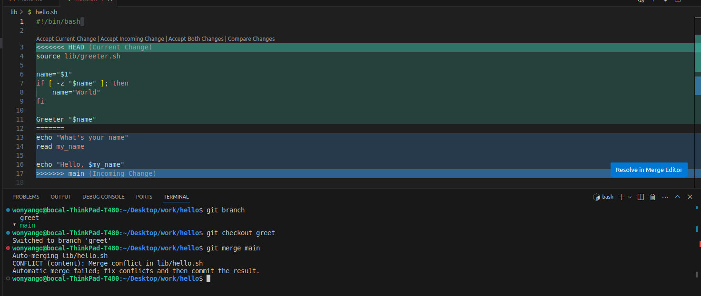
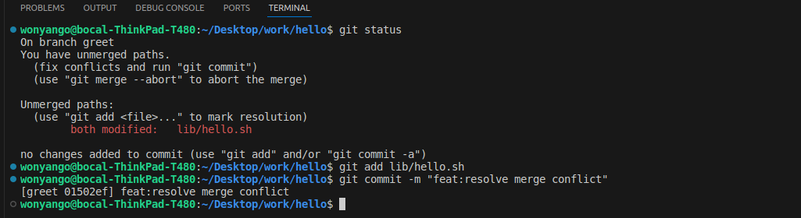
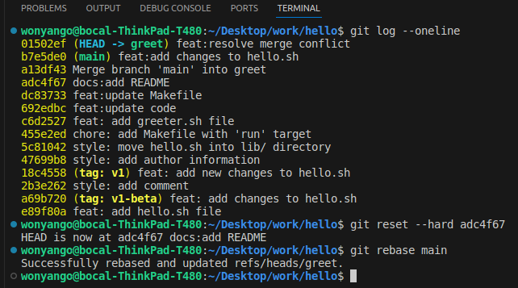
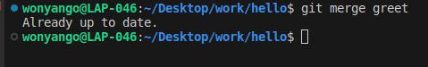

### Merge Main into Greet Branch: 

To merge main into greet one has to be inside greet then use:

```console
git merge main
```

If an interactive window opens up just press Ctrl+X:



I then checked out main and made changes to hello.sh



### Merging Main into Greet Branch (Conflict): 

I tried merging main into greet and encountered a conflict:


I then went ahead and accepted the incoming changes and made commit for the resolution:



### Rebasing Greet Branch:

I went back to the point before the initial merge then I did a rebase:

```console
git rebase main
```


### Merging Greet into Main: 

Since the greet branch was rebased on top of the latest main branch, there should be no new changes to merge(the latest changes from main are in the greet branch). The output should indicate that main is already up to date:



**Fast-forward** occurs when the branch one is merging into has no new commits since the other branch was created or last synced. In this case, Git simply moves the pointer of the current branch forward to the end of the branch being merged. No new commit is created. This happens because the history of the current branch is a subset of the history of the branch being merged.

**Merge:** When one merge one branch into another, Git creates a new commit (a merge commit) that has two parent commits: one from each branch.

A merge retains the complete history of all branches, showing exactly when branches diverged and merged. However, history can become cluttered with many merge commits.

**Rebasing** moves or reapplies commits(note that the hash of the reapplied commits change) from a branch on top of another branch. It changes the base of the branch to the latest commit on the target branch.

It results in a linear history, as if all work happened sequentially.