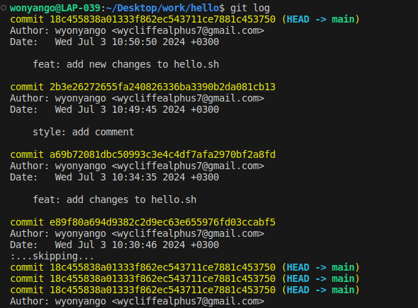
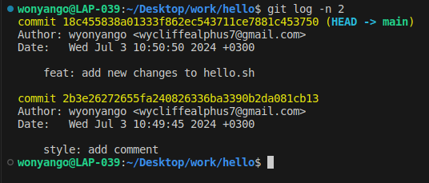
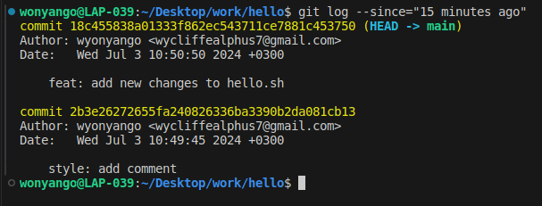
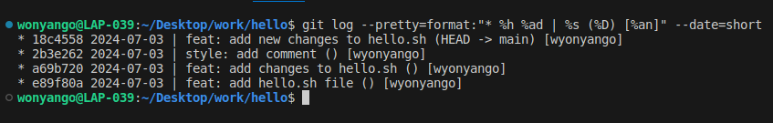

## History

Show the history of the repository using the command:
```console
git log
```



To get a condensed view of the history use:

```console
git log --oneline
```


#### Controlled Entries: 
To display the last 2 commits use:
```console
git log -n 2
```


To view the commits made in the last 5 minutes use:
```
git log --since="5 minutes ago"
```
However, since more than 5 minutes had passed since the last commit, I decided to change it to last 15 minutes: 
```console
git log --since="15 minutes ago"
```


To show commits in a personalized format, for example

```
* e4e3645 2023-06-10 | Added a comment (HEAD -> main) [John Doe]
```
Use:

```
git log --pretty=format:"* %h %ad | %s (%D) [%an]" --date=short
```
%h - placeholder for abbreviated commit hash

%ad - placeholder for the author date

%s - placeholder for commit message

%D - placeholder for branches or tags pointing to the commit

%an - placeholder for author name

--date=short - ensure the date is in the format YYYY-MM-DD

