### Clone Repository

Use the command:

```console
git clone hello hello_clone
```
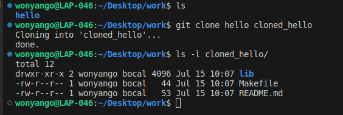

### Show logs for hello_clone

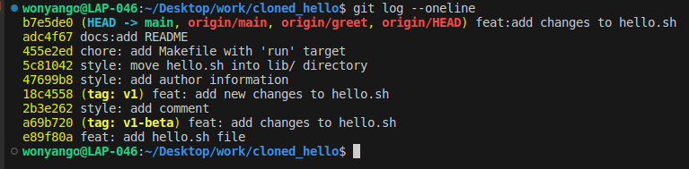

### Display the name of the remote repository 

```console
git remote
```

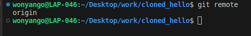

To get detailed information:

```console
git remote -v
```

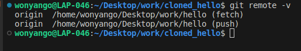

### List all remote and local branches in the cloned_hello repository.

```console
git branch -a
```
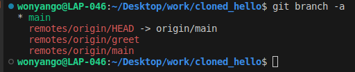

### I made changes to original repository and updated the README.md file with the provided content, and commited the changes.

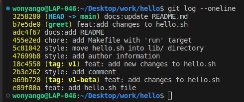

### In the cloned_hello, I fetched the changes from the remote repository and displayed the logs.

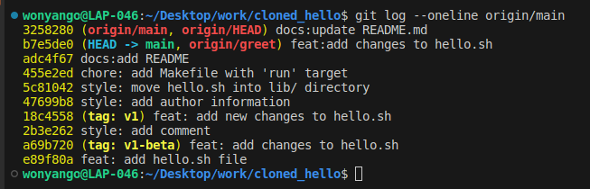

### Merge the changes from the remote main branch into the local main branch.

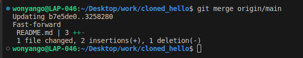

### Add a local branch named greet tracking the remote origin/greet branch.

```console
git checkout -b greet origin/greet
```
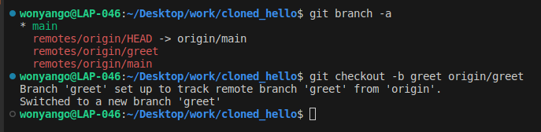

### Add a remote to your Git repository and push the main and greet branches to the remote.

To add a remote use:

```console
git remote add origin <url>
```
However the command led to an error indicating that origin already exists, therefore I used:

```console
git remote set-url origin <url>
```
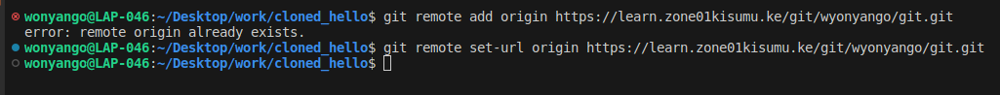

To push main:

```console
git push -u origin main
```
To push greet:

```console
git push -u origin greet
```
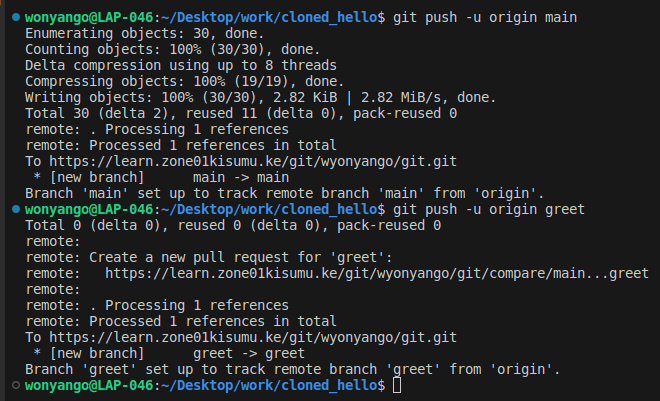

**The single git command equivalent to what was done with the fetching and merging changes from remote to local main branch is:**

```console
git pull
```
