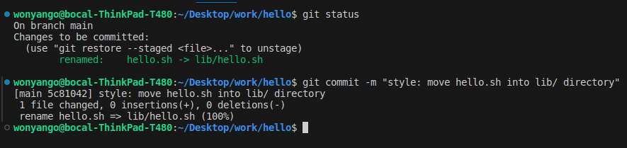
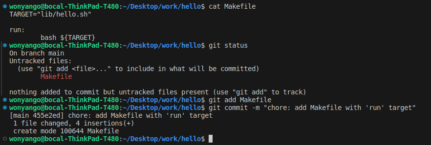

## Move it

To move hello.sh to lib/ directory first create the lib directory using:

```console
mkdir lib
```
Then:

```console
git mv hello.sh lib/
```
Then commit the move:



I then created a make file in the root directory of the repo and then made a commit to the repository.

