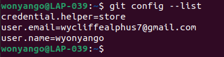

## Setting Up Git

To install git on the local machine(ubuntu), first open the terminal(Ctrl+Alt+T), then use the commands Use the commands
```console
sudo apt update
sudo apt install git
```
For my case git is already installed therefore I just verified it using :
```console
git --version
```


To configure git with the email and username I used:
```
git config --global user.email "wycliffealphus7@gmail.com"
```

```console
git config --global user.name "wyonyango"
````

My machine is already configured, to confirm run the command:
```console
git config --list
```
