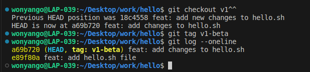

## TAG me

#### To tag the current version of the repository as v1 use: 

```console
git tag v1
```


#### To tag the previous version as v1-beta, first checkout to it:

```console
git checkout v1^^
```
Then tag it:

```console
git tag v1-beta
```


#### To navigate tags use:
```console
git checkout v1
```
and 
```console
git checkout v1-beta
```


#### To list the tags use:
```console
git tag
```

