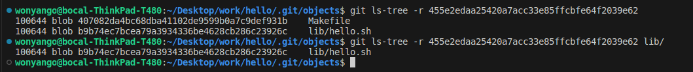

## blobs, trees and commits

#### Exploring .git/ Directory: 


**branches:** This directory would typically contain references to branches in your Git repository.

**COMMIT_EDITMSG:** This file is used by Git to store the commit message when one is in the process of making a commit.

**config:** The Git configuration file for this repository, which stores settings and options.

**description:** A file that can hold a description or notes about the repository.

**HEAD:** A reference to the currently checked-out branch (or commit) in the repository.

**hooks:** This directory contains scripts that Git executes at certain points (like pre-commit, post-commit, etc.).

**index:** Also known as the staging area or index, it stores information about what will go into the next commit.

**info:** This directory typically contains the global excludes file and other repository-specific information.

**logs:** Logs of various updates to refs (branches and tags) in the repository.

**objects:** This directory stores all the content for your database (commits, trees, blobs).

**ORIG_HEAD:** This reference is typically created by Git to store the previous state of HEAD before certain operations.

**packed-refs:** A file that stores references to commits that have been packed.

**refs:** This directory stores references (pointers) to commits, tags, and branches.

### Details

**1. objects/**

The objects/ directory in a Git repository is where all the data for the repository is stored. Git stores everything as objects, which can be blobs (file contents), trees (directory structures), commits, or tags.

    Format: Inside the objects/ directory, Git organizes objects into subdirectories using the first two characters of the object's SHA-1 hash.
    Usage: When you commit changes, Git stores the changes as objects in this directory. These objects are immutable and can be referenced by their SHA-1 hashes.

**2. config**

The config file is a Git configuration file that resides in the .git/ directory of the repository. It contains settings and configurations for a Git repository.

    The config file includes configurations such as user name, email, remote repositories, branch settings, and more.

    One can edit this file directly using a text editor or use Git commands (git config) to modify its contents.

**3. refs**

The refs/ directory in a Git repository contains references (pointers) to commits, tags, and branches. References are stored as files under refs/, and they point to specific commits or objects within the objects/ directory.

    It has subdirectories like refs/heads/ (for branches), refs/tags/ (for tags), and refs/remotes/ (for remote-tracking branches).

    When you create a branch or tag, Git creates a file under the relevant subdirectory within refs/ to store the reference.

    Git commands such as git branch, git tag, and others manipulate these references to manage branches and tags.

**4. HEAD**

The HEAD file in a Git repository is a reference to the currently checked-out branch or, in some cases, a specific commit (detached HEAD state).
```
    HEAD points to the branch you are currently working on. It is a symbolic reference to the current branch name or directly to a commit hash if you are in a detached state (not on a branch).

    The HEAD file is located at .git/HEAD.

    Git uses HEAD to know where one is in the commit history. When one makes a new commit, Git updates the branch reference that HEAD points to.

```
#### Latest Object Hash: 

To find the latest object hash within the .git/objects/ directory use the command:
```console
git rev-list --objects --all | head -n 1
```

To print the type use:

```console
git cat-file -t
```
And to print the contents use:
```console
git cat-file -p
```


#### Dumping Directory Tree:

To dump the directory tree referenced by this commit use:
```console
 git ls-tree -r <hash>
```

To dump the content of lib/

```console
git ls-tree -r <hash> lib/
```


The following can also be used to dump the content of lib/

```console
git ls-tree main lib/
```

To damp the contents of hello.sh
Since hello.sh is a blob use:
```console
git cat-file -p <hash of hello.sh>
```


