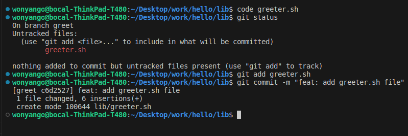
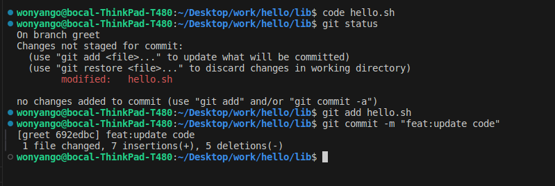
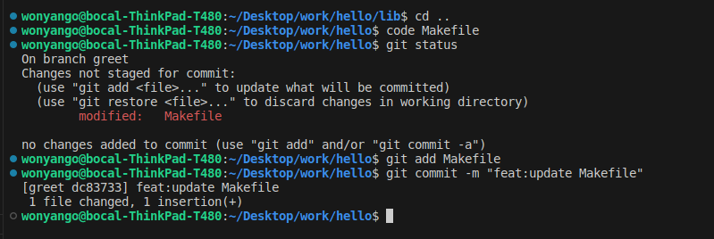
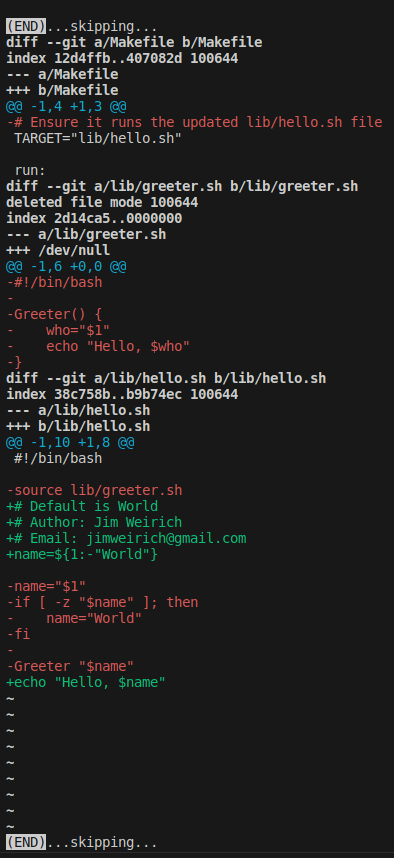
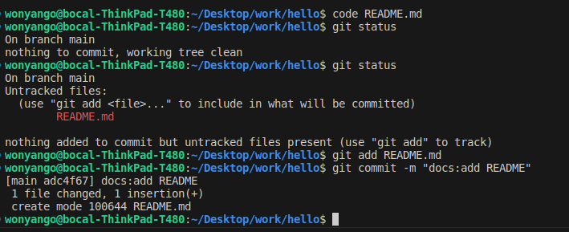

## Create and Switch to New Branch: 

To creat a local branch named greet and switch to it use:

```console
git checkout -b greet
```
I then created a file named greeter.sh:



I then updated the hello.sh file:



I also updated the Makefile:



Switch back to the main branch, compare and show the differences between the main and greet:
Use:

```console
git diff greet
```


I then added a README.md and committed it:



Drawing of diverging changes

